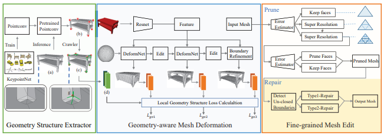
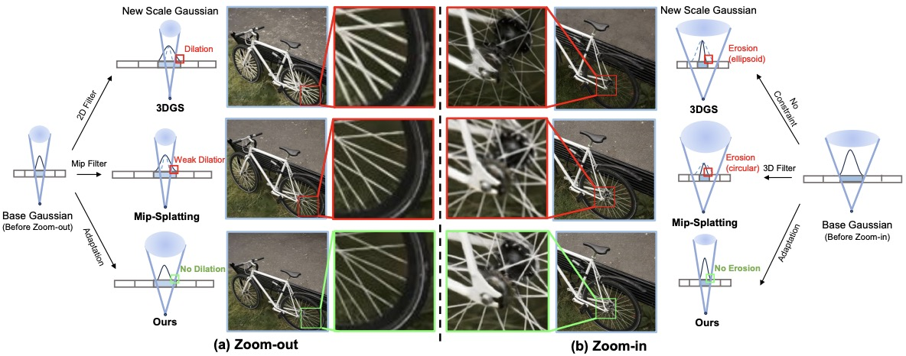
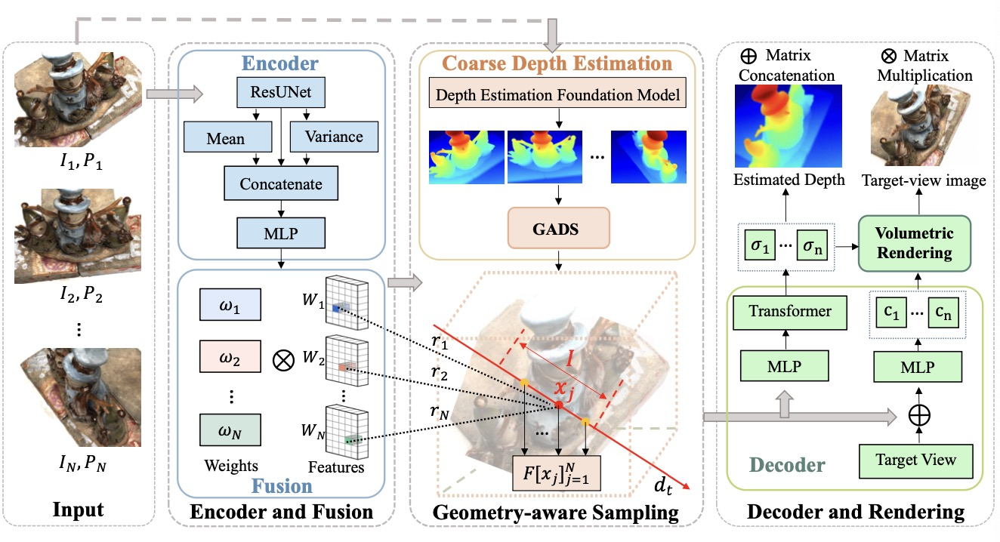
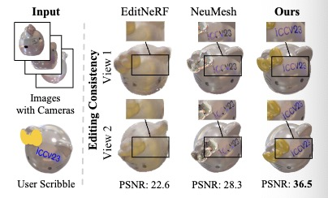
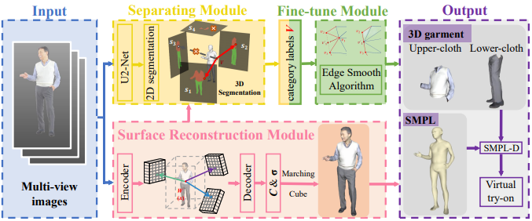
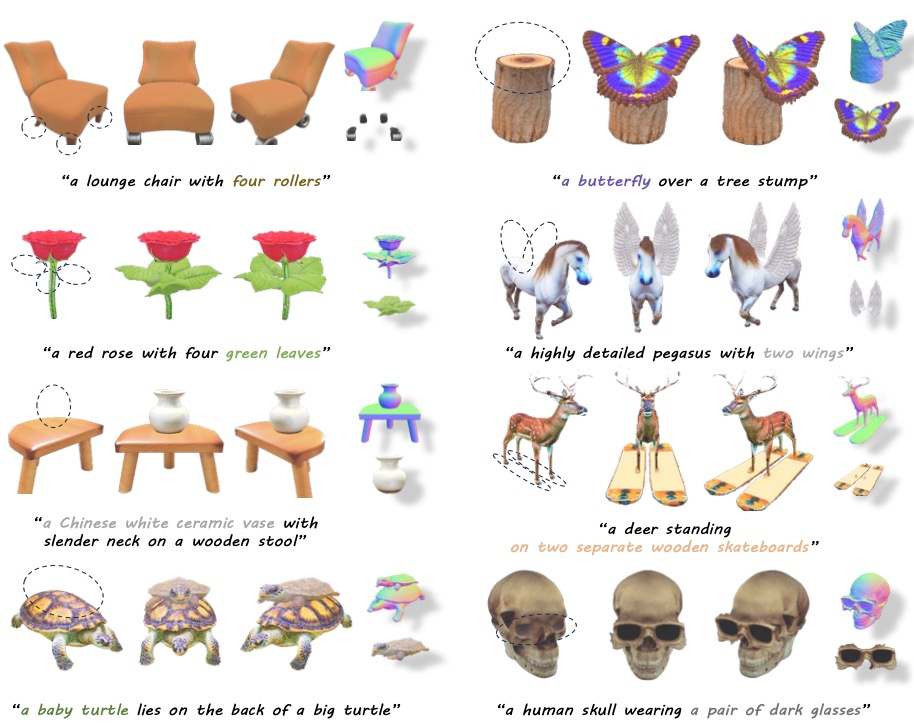
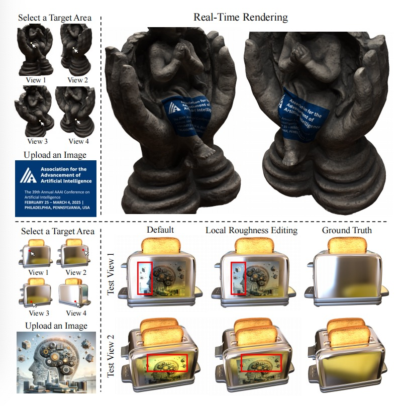

Biography
---------

I am a final-year direct Ph.D. student at Shanghai Jiao Tong University, advised by Prof. <a href="https://english.seiee.sjtu.edu.cn/english/detail/842_816.htm">Wenjun Zhang</a>, co-advised by Prof. <a href="https://scholar.google.com.sg/citations?user=eUbmKwYAAAAJ&hl=en">Bingbing Ni</a>. From November 2022 to June 2024, I was a visiting Ph.D. student at ETH Zurich, advised by Prof. <a href="https://scholar.google.com/citations?user=TwMib_QAAAAJ&hl=en">Luc Van Gool</a> and Prof. <a href="https://scholar.google.com/citations?user=YYH0BjEAAAAJ&hl=en">Marc Pollefeys</a>. Before that, I received my bachelor's degree in information engineering from Xidian University, Xi'an, China, in 2019.

My research interests lie at the intersection of computer vision and computer graphics, including 3D reconstruction, novel view synthesis, 3D generation and editing.

<!-- News
----

<ul>
  <li>[04/2023] I have received 100 citations! </li>
  <li>[02/2023] One paper is accepted by CVPR2023. </li>
  <li>[10/2022] One paper is accepted by TIP. </li>
  <li>[06/2022] Two papers are accepted by ACM MM 2022.</li>
  <li>[12/2021] I am recognized as an outstanding student of Fudan University.</li>
  <li>[06/2021] One paper is accepted by ACM MM 2021.</li>
  <li>[04/2021] One paper is accepted by ICMR 2021.</li>
  <li>[07/2020] One paper is accepted by ACM MM 2020.</li>
  <li>[12/2019] I am awarded the Chinese National Scholarship.</li>
  <li>[07/2019] One paper is accepted by ACM MM 2019.</li>
</ul> -->

<!-- Selected Publications
# To update this
------

            

                
            
   
            

            
<a href="">ME-D2N: Multi-Expert Domain Decompositional Network for Cross-Domain Few-Shot Learning</a> <strong>Yue Shi</strong>, Yu Xie, Yanwei Fu, Jingjing Chen, Yu-Gang Jiang  ACM International Conference on Multimedia (<strong>ACM MM</strong>), 2022.  [<a href="">Paper Coming Soon</a>][<a href="https://github.com/lovelyqian/ME-D2N_for_CDFSL">Code</a>]

            

 -->

Research
------------

<table style="width:120%">
  <tr>
    <th width="40%">
      
    </th>
    <th style="text-align:left" width="60%">
            Geometric granularity aware pixel-to-mesh 
            Yue Shi, Bingbing Ni, Jinxian Liu, Dingyi Rong, Ye Qian, Wenjun Zhang 
             Proceedings of the IEEE/CVF International Conference on Computer Vision (<strong>ICCV</strong>), 2021. 
            [<a href="https://openaccess.thecvf.com/content/ICCV2021/papers/Shi_Geometric_Granularity_Aware_Pixel-To-Mesh_ICCV_2021_paper.pdf">Paper</a>]
    </th>
  </tr> 
</table>

<table style="width:120%">
  <tr>
    <th width="40%">
      
    </th>
    <th style="text-align:left" width="60%">
            Mipmap-GS: Let Gaussians Deform with Scale-specific Mipmap for Anti-aliasing Rendering 
            
  Jiameng Li*, 
  <strong>Yue Shi*</strong>, 
  Jiezhang Cao, Bingbing Ni, Wenjun Zhang, Kai Zhang, Luc Van Gool
 
             International Conference on 3D Vision(<strong>3DV</strong>), 2021. 
            [<a href="https://arxiv.org/abs/2408.06286">Paper</a>]
    </th>
  </tr> 
</table>

<table style="width:120%">
  <tr>
    <th width="40%">
      
    </th>
    <th style="text-align:left" width="60%">
            GARF: Geometry-aware generalized neural radiance field 
            Yue Shi, Dingyi Rong, Bingbing Ni, Chang Chen, Wenjun Zhang 
            Displays, Under Review (Minor Revision). 
            [<a href="https://arxiv.org/pdf/2212.02280.pdf">Paper</a>]
    </th>
  </tr> 
</table>

<table style="width:120%">
  <tr>
    <th width="40%">
      
    </th>
    <th style="text-align:left" width="60%">
            Learning Geometry and Appearance for Improved Radiance Fields Editing 
            Yue Shi, Rui Shi, Yuxuan Xiong, Jiezhang Cao, Bingbing Ni, Wenjun Zhang, Luc Van Gool 
      International Journal of Computer Vision (IJCV), Under Review.       
      [<a href="https://drive.google.com/file/d/1hVSAEM82ibnsklURHG0SC8ZoE7RYStew/view?usp=drive_link">Demo</a>]
    </th>
  </tr> 
</table>

<table style="width:120%">
  <tr>
    <th width="40%">
      
    </th>
    <th style="text-align:left" width="60%">
            USR: Unsupervised separated 3d garment and human reconstruction via geometry and semantic consistency 
            Yue Shi, Yuxuan Xiong, Bingbing Ni, Wenjun Zhang 
            arXiv preprint, 2023. 
                  [<a href="https://arxiv.org/pdf/2302.10518.pdf">Paper</a>]
    </th>
  </tr> 
</table>

<table style="width:120%">
  <tr>
    <th width="40%">
      
    </th>
    <th style="text-align:left" width="60%">
            FocalDreamer: Text-driven 3D Editing via Focal-fusion Assembly 
            Yuhan Li，Yishun Dou, Yue Shi, Yu Lei, Xuanhong Chen, Yi Zhang, Peng Zhou, Bingbing Ni 
            Proceedings of the AAAI Conference on Artificial Intelligence(AAAI), 2024. 
            [<a href="https://arxiv.org/pdf/2308.10608.pdf">Paper</a>]
    </th>
  </tr> 
</table>

<table style="width:120%">
  <tr>
    <th width="40%">
      
    </th>
    <th style="text-align:left" width="60%">
            Deep Equilibrium Diffusion Restoration with Parallel Sampling 
            Jiezhang Cao, Yue Shi, Kai Zhang, Yulun Zhang, Radu Timofte, Luc Van Gool 
            IEEE/CVF Conference on Computer Vision and Pattern Recognition (CVPR), 2024. 
            [<a href="[https://arxiv.org/pdf/2308.10608.pdf](https://openaccess.thecvf.com/content/CVPR2024/html/Cao_Deep_Equilibrium_Diffusion_Restoration_with_Parallel_Sampling_CVPR_2024_paper.html)">Paper</a>]
    </th>
  </tr> 
</table>

<table style="width:120%">
  <tr>
    <th width="40%">
      
    </th>
    <th style="text-align:left" width="60%">
            InstantSticker: Realistic Decal Blending via Disentangled Object Reconstruction 
            Yi Zhang, Xiaoyang Huang, Yishun Dou, Yue Shi, Rui Shi, Ye Chen, Bingbing Ni, Wenjun Zhang 
            Proceedings of the AAAI Conference on Artificial Intelligence(AAAI), 2025. 
    </th>
  </tr> 
</table>

<!-- <ul>
  <li>
    
<a href="">ME-D2N: Multi-Expert Domain Decompositional Network for Cross-Domain Few-Shot Learning</a> <strong>Yue Shi</strong>, Yu Xie, Yanwei Fu, Jingjing Chen, Yu-Gang Jiang  ACM International Conference on Multimedia (<strong>ACM MM</strong>), 2022.  [<a href="">Paper Coming Soon</a>][<a href="https://github.com/lovelyqian/ME-D2N_for_CDFSL">Code</a>]

  </li>
  <li>
    
<a href="">TGDM: Target Guided Dynamic Mixup for Cross-Domain Few-Shot Learning</a> Linhai Zhuo, <strong>Yue Shi</strong>, Jingjing Chen, Yixin Cao, Yu-Gang Jiang  ACM International Conference on Multimedia (<strong>ACM MM</strong>), 2022.  [<a href="">Paper Coming Soon</a>]

  </li>
  <li>
    
<a href="https://arxiv.org/abs/2203.07656">Wave-SAN: Wavelet based Style Augmentation Network for Cross-Domain Few-Shot Learning</a>  <strong>Yue Shi</strong>, Yu Xie, Yanwei Fu, Jingjing Chen, Yu-Gang Jiang  arXiv preprint, 2022.   [<a href="https://arxiv.org/pdf/2203.07656.pdf">Paper</a>]

  </li>
  <li>
    
<a href="https://arxiv.org/abs/2107.11978">Meta-FDMixup: Cross-Domain Few-Shot Learning Guided by Labeled Target Data</a> <strong>Yue Shi</strong>, Yanwei Fu, Yu-Gang Jiang  ACM International Conference on Multimedia (<strong>ACM MM</strong>), 2021.   [<a href="https://arxiv.org/pdf/2107.11978.pdf">Paper</a>][<a href="https://github.com/lovelyqian/Meta-FDMixup">Code</a>][<a href="https://www.youtube.com/watch?v=G8Mlde4FpsU">Youtube Video</a>][<a href="https://www.bilibili.com/video/BV1xT4y1f7B6?spm_id_from=333.999.0.0&vd_source=668a0bb77d7d7b855bde68ecea1232e7">Bilibili Video</a>]

  </li>
  <li>
    
<a href="https://arxiv.org/abs/2107.11756">Can Action be Imitated? Learn to Reconstruct and Transfer Human Dynamics from Videos</a> <strong>Yue Shi</strong>, Yanwei Fu, Yu-Gang Jiang  International Conference on Multimedia Retrieval (<strong>ICMR</strong>). 2021. (<strong>Oral</strong>)  [<a href="https://arxiv.org/pdf/2107.11756.pdf">Paper</a>][<a href="https://www.bilibili.com/video/BV1VY41147xt?spm_id_from=333.999.0.0">Bilibili Video</a>]

  </li>
  <li>
    
<a href="https://arxiv.org/abs/2010.09982">Depth Guided Adaptive Meta-Fusion Network for Few-shot Video Recognition
</a> <strong>Yue Shi</strong>, Li Zhang, Junke Wang, Yanwei Fu, Yu-Gang Jiang  ACM International Conference on Multimedia (<strong>ACM MM</strong>), 2020. (<strong>Oral</strong>)  [<a href="https://arxiv.org/pdf/2010.09982.pdf">Paper</a>][<a href="https://github.com/lovelyqian/AMeFu-Net">Code</a>][<a href="https://www.youtube.com/watch?v=KqNYuZD5xdw">Youtube Video</a>][<a href="https://www.bilibili.com/video/BV1i44y1t78U?spm_id_from=333.999.0.0">Bilibili Video</a>]

  </li>
  <li>
    
<a href="http://www.cs.cmu.edu/~yuxiongw/research/Embodied_One-Shot_Video_Recognition_Learning_from_Actions_of_a_Virtual_Embodied_Agent.pdf"> Embodied One-Shot Video Recognition: Learning from Actions of a Virtual Embodied Agent </a>  <strong>Yue Shi</strong>, Chengrong Wang, Yanwei Fu, Yu-Xiong Wang, Cong Bai, Xiangyang Xue, Yu-Gang Jiang  ACM International Conference on Multimedia (<strong>ACM MM</strong>), 2019. (<strong>Oral</strong>)   [<a href="http://www.cs.cmu.edu/~yuxiongw/research/Embodied_One-Shot_Video_Recognition_Learning_from_Actions_of_a_Virtual_Embodied_Agent.pdf">Paper</a>][<a href="https://github.com/lovelyqian/Embodied-One-Shot-Video-Recognition">Code</a>][<a href="http://www.sdspeople.fudan.edu.cn/fuyanwei/dataset/UnrealAction/">UnrealAction Dataset</a>]

  </li>
</ul> -->
